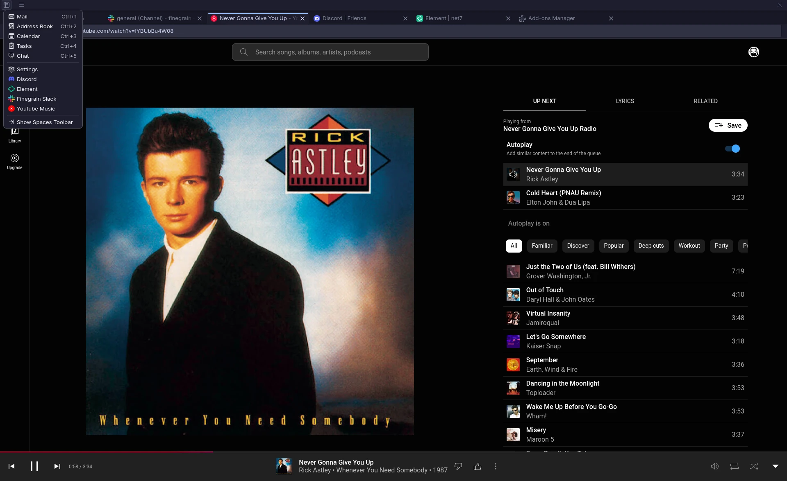

# Thunderbird shortcuts

Small addons to add URL shortcuts to Thunderbird.



## Usage

### Webpage

You can easily create a new shortcut by using the
[Thunderbird Shortcut Generator](https://laurent2916.github.io/thunderbird-shortcuts/).

Examples:
- [YouTube Music](https://laurent2916.github.io/thunderbird-shortcuts/?name=YouTube%20Music&url=https://music.youtube.com/&logoUrl=https://upload.wikimedia.org/wikipedia/commons/6/6a/Youtube_Music_icon.svg)
- [YouTube](https://laurent2916.github.io/thunderbird-shortcuts/?name=YouTube&url=https://www.youtube.com/&logoUrl=https://upload.wikimedia.org/wikipedia/commons/0/09/YouTube_full-color_icon_%282017%29.svg)
- [Slack](https://laurent2916.github.io/thunderbird-shortcuts/?name=Slack&url=https://app.slack.com/client/&logoUrl=https://upload.wikimedia.org/wikipedia/commons/d/d5/Slack_icon_2019.svg)
- [Discord](https://laurent2916.github.io/thunderbird-shortcuts/?name=Discord&url=https://discord.com/channels/@me&logoUrl=https://upload.wikimedia.org/wikipedia/fr/4/4f/Discord_Logo_sans_texte.svg)
- [Element](https://laurent2916.github.io/thunderbird-shortcuts/?name=Element&url=https://app.element.io/&logoUrl=https://upload.wikimedia.org/wikipedia/commons/c/cb/Element_%28software%29_logo.svg)
- [ChatGPT](https://laurent2916.github.io/thunderbird-shortcuts/?name=ChatGPT&url=https://chat.openai.com/&logoUrl=https://upload.wikimedia.org/wikipedia/commons/0/04/ChatGPT_logo.svg)
- [Google Calendar](https://laurent2916.github.io/thunderbird-shortcuts/?name=Google%20Calendar&url=https://calendar.google.com/&logoUrl=https://upload.wikimedia.org/wikipedia/commons/a/a5/Google_Calendar_icon_%282020%29.svg)
- [Google Mail](https://laurent2916.github.io/thunderbird-shortcuts/?name=Google%20Mail&url=https://mail.google.com/&logoUrl=https://upload.wikimedia.org/wikipedia/commons/7/7e/Gmail_icon_%282020%29.svg)
- [ProtonMail](https://laurent2916.github.io/thunderbird-shortcuts/?name=ProtonMail&url=https://mail.proton.me/&logoUrl=https://upload.wikimedia.org/wikipedia/commons/0/0c/ProtonMail_icon.svg)
- [Hacker News](https://laurent2916.github.io/thunderbird-shortcuts/?name=Hacker%20News&url=https://news.ycombinator.com/&logoUrl=https://upload.wikimedia.org/wikipedia/commons/b/b2/Y_Combinator_logo.svg)
- [GitHub](https://laurent2916.github.io/thunderbird-shortcuts/?name=GitHub&url=https://github.com/&logoUrl=https://upload.wikimedia.org/wikipedia/commons/9/91/Octicons-mark-github.svg)
- [HuggingFace](https://laurent2916.github.io/thunderbird-shortcuts/?name=HuggingFace&url=https://huggingface.co/&logoUrl=https://huggingface.co/front/assets/huggingface_logo.svg)
- [Twitter](https://laurent2916.github.io/thunderbird-shortcuts/?name=Twitter&url=https://twitter.com/&logoUrl=https://upload.wikimedia.org/wikipedia/commons/6/6f/Logo_of_Twitter.svg)
- [Spotify](https://laurent2916.github.io/thunderbird-shortcuts/?name=Spotify&url=https://open.spotify.com/&logoUrl=https://upload.wikimedia.org/wikipedia/commons/1/19/Spotify_logo_without_text.svg)
- [Twitch](https://laurent2916.github.io/thunderbird-shortcuts/?name=Twitch&url=https://www.twitch.tv/&logoUrl=https://upload.wikimedia.org/wikipedia/commons/d/d3/Twitch_Glitch_Logo_Purple.svg)

### Build with nix (flakes)

`flake.nix` already contains some examples, you can build them like so:

```shell
nix build github:Laurent2916/thunderbird-shortcuts#youtube-music
nix build github:Laurent2916/thunderbird-shortcuts#discord
...
```

### Use with nix (flakes)

You can also use the shortcuts directly in your own flakes:

1. Add this flake as an input to your flake:

```nix
# flake.nix
{
  inputs = {
    thunderbird-shortcuts = {
      url = "github:Laurent2916/thunderbird-shortcuts";
      inputs.nixpkgs.follows = "nixpkgs";  # optional
      inputs.systems.follows = "systems";  # optional
    };
  };
}
```

2. You can then use the provided `package` and `lib`, for example with
[home-manager](https://github.com/nix-community/home-manager) and
[thunderbird](https://github.com/nix-community/home-manager/blob/master/modules/programs/thunderbird.nix):

```nix
{system, pkgs, thunderbird-shortcuts, ...}: {
  programs.thunderbird = {
    enable = true;
    profiles = {
      my_profile = {
        extensions = [
          thunderbird-shortcuts.packages."${system}".youtube-music
          thunderbird-shortcuts.packages."${system}".discord
          (
            thunderbird-shortcuts.lib.genShortcut {
              inherit pkgs;
              name = "arXiv";
              url = "https://arxiv.org/";
              logo = pkgs.fetchurl {
                url = "https://upload.wikimedia.org/wikipedia/commons/b/bc/ArXiv_logo_2022.svg";
                sha256 = "sha256-Lc2IQPRoWcXim13yCxX5iqhyVOCeze2ywRoe1QKFBPw=";
              };
            };
          )
        ];
      };
    };
  };
}
```

## FAQ

### Ok but why?

I always have Thunderbird opened (for emails and RSS),
I also always have "persistent" tabs opened in my browser (e.g. Slack, YT Music, etc.),
so why not have them in the same place?

### How to get notifications?

Even though Thunderbird uses the same engine as Firefox, some features are not enabled.
You can auto-accept notifications by setting the following in `about:config`:
```
permissions.default.desktop-notification = 1
```

### How can I use the webcam/microphone?

I haven't figured this one yet, if you have any idea, please let me know.

### Some site are saying my browser isn't supported?

A workaround that generally works is to change the user-agent of Thunderbird to spoof a real browser.
For example, in `about:config`:
```
general.useragent.override = "Mozilla/5.0 (X11; Linux x86_64; rv:133.0) Gecko/20100101 Firefox/133.0"
```

## Acknowledgements

- [github:tdmrhn/Thunderbird-Quick-Access-Buttons](https://github.com/tdmrhn/Thunderbird-Quick-Access-Buttons/)
